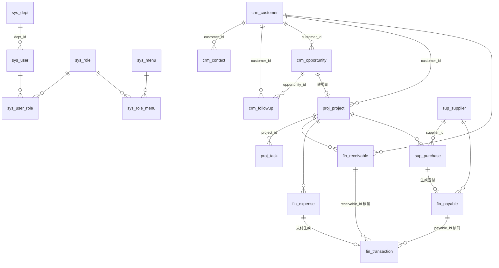

# 企业内部管理系统 — 系统设计说明

> 技术栈：PHP 8.0 + MySQL 8.0（兼容 5.7）+ 自研轻量 MVC + Layui 2.9（后台 UI）+ ECharts 5
> 目标：一套**零 Composer 依赖、可直接部署在普通 PHP 主机**上的内部管理后台，覆盖「客户 → 商机 → 执行 → 财务」业务闭环，并配套供应商与 RBAC 权限管理。

---

## 1. 总体架构

```
浏览器 (Layui 页面 + iframe 弹层)
      │  HTML 页面 / JSON 接口 (X-CSRF-Token)
      ▼
public/index.php  ── 单一入口
      │
app/Core/App ── Router(路由表 + 权限码) ── 登录校验 ── 权限校验 ── CSRF 校验
      │
Controllers ──┬─ ResourceController (通用 CRUD 引擎，字段驱动)
              │     └─ 各业务控制器：声明 表/字段/钩子
              ├─ DashboardController (聚合统计)
              └─ AuthController (登录/退出/改密)
      │
Services (FinanceService 跨表汇总)    Core/DB (PDO 预处理)    Core/Logger (操作日志)
      │
MySQL (sys_* / crm_* / proj_* / fin_* / sup_*)
```

### 1.1 设计取舍

| 决策 | 选择 | 原因 |
|---|---|---|
| 后端框架 | 自研 ~1000 行微内核 | 内部系统规模适中；免 Composer，便于在虚拟主机/内网部署；团队易读易改 |
| 前端框架 | Layui 2.9（CDN） | 经典轻量的 webadmin UI，表格/表单/弹层/树组件开箱即用，无需构建工具 |
| 页面模式 | 服务端渲染 + Layui 表格异步取数 | 无 SPA 构建链，SEO/首屏无关；表格分页走 JSON |
| CRUD 实现 | 字段配置驱动的 `ResourceController` | 新增一个业务模块≈写一个 50 行的字段定义类 |
| 删除策略 | 业务表软删除 (`deleted_at`) | 财务/客户数据可追溯；日志表物理不可删 |
| 枚举 | TINYINT + `app/Dict.php` | 改文案不动库；查询性能好 |

### 1.2 目录结构

```
app/
  Core/            框架内核：App Router DB Auth Csrf View Request Response Logger ResourceController
  Controllers/     业务控制器（System/ 为系统管理）
  Services/        跨模块业务服务（FinanceService）
  Views/           PHP 模板：layout/ common/ auth/ dashboard/ system/
  Dict.php         业务字典（枚举）
  bootstrap.php    自动加载、配置、会话
config/
  config.php       默认配置（读取环境变量）
  config.local.php 本地覆盖（不入库）
  routes.php       路由与权限码
database/
  schema.sql       表结构
  seed.sql         初始化：部门/角色/菜单权限/管理员
  demo.sql         演示数据（可选）
public/            Web 根目录：index.php、.htaccess、assets/
storage/logs/      PHP 错误日志
docker/ Dockerfile docker-compose.yml
```

---

## 2. 功能模块

### 2.1 仪表盘
按当前用户**权限 + 数据范围**动态展示：
- KPI：客户总数/本月新增、进行中商机金额（含加权金额）、进行中项目、应收未收/逾期笔数、本月收支、待审批报销
- 图表：近 12 个月收支趋势（柱状）、商机漏斗、项目状态分布（环形）
- 待办：我的未完成任务、近 7 天需跟进客户、30 天内到期应收

### 2.2 客户管理（CRM）
| 功能 | 说明 |
|---|---|
| 客户 | 类型/等级/状态/来源/行业/负责人/下次跟进日；**名称查重**；有项目的客户禁止删除 |
| 联系人 | 归属客户；每客户唯一主联系人（自动互斥）；数据范围跟随客户负责人 |
| 跟进记录 | 电话/拜访/微信/邮件/会议；保存后自动回写客户「下次跟进日」，潜在客户自动转「跟进中」 |
| 客户 360 | 详情页 Tab 聚合：联系人、跟进、商机、项目、应收 |

### 2.3 商机管理
- 销售阶段：初步接洽(10%) → 需求确认(30%) → 方案报价(50%) → 商务谈判(70%) → **赢单**(100%) / 输单(0%)
- 赢率留空按阶段自动填充；输单必须填写原因；进入赢单/输单自动记录关闭日期
- 赢单自动把客户状态置为「已成交」
- **一键转项目**：赢单商机 → 生成执行项目（带入客户、合同金额，生成项目编号），防重复转换

### 2.4 执行管理（签证 / 公司注册）
四张表，数据按阶段自动流转：

```
签证表 / 公司注册表（在途）
   │  办理状态/业务状态 = 已完成（保存即触发）
   ▼
供应商应付（付款状态：待付款）     ← 可「退回在途」
   │  付款状态 = 已付款（编辑保存 或「标记已付款」）
   ▼
完成项目（只读归档）               ← 可「撤回到应付」
```

| 表 | 字段 | 说明 |
|---|---|---|
| 签证表 | 业务群名、对接人、具体业务、申请对象、开始日期、供应商、结束日期、交付文件、办理状态 | 只显示在途签证 |
| 公司注册表 | 业务群名、对接人、具体业务、开始日期、供应商、结束日期、交付文件、业务状态 | 只显示在途公司注册 |
| 供应商应付 | 以上业务信息（只读）+ 完成时间、应付金额、付款状态（待付款/已付款）、付款日期、付款备注 | 不能直接新增；按业务类型/供应商筛选 |
| 完成项目 | 全部信息 + 付款日期 | 只读，可导出 |

- 实现：四张表共用 `exec_business`，以 `biz_type`（1 签证 / 2 公司注册）+ `stage`（1 在途 / 2 供应商应付 / 3 完成项目）区分；
  “跳转”即改变 stage，不复制数据，交付文件和历史信息全程保留，操作日志可追溯
- 交付文件：通用附件字段，多文件上传，存于 `storage/uploads`（不在 Web 根目录），凭随机 key 登录后下载
- 旧版「项目列表 / 任务」菜单已停用（数据与代码保留，财务中的「关联项目」仍可用）

### 2.5 财务管理
```
应收款(回款计划) ◄── 核销 ── 收支流水(收入)
应付款           ◄── 核销 ── 收支流水(支出) ◄── 报销支付自动生成
     ▲
采购订单「生成应付」
```
| 功能 | 说明 |
|---|---|
| 应收款 | 按项目拆分回款节点（首付/进度/尾款）；已收金额与状态（未结清/部分/已结清）**由流水自动汇总**，不可手改 |
| 应付款 | 关联供应商/采购单/项目；已付金额同理自动汇总 |
| 收支流水 | 真实资金进出：类型、类别、账户、凭证号；可核销应收/应付（类型校验、自动带出客户/供应商/项目） |
| 费用报销 | 单号 `BX+日期+序号`；流程：待审批 →（通过/驳回）→ 支付；驳回后可修改重提；**不能审批自己的单据**；支付自动生成支出流水并关联 |

### 2.6 供应商管理
- 供应商档案：类别、联系人、税号、银行账户、评级（A~D）、合作状态（合作中/暂停/黑名单）；名称查重
- 采购订单：单号 `PO+日期+序号`；黑名单供应商禁止下单；**一键生成应付款**（防重复）
- 有采购单的供应商禁止删除（建议改为「暂停合作」）

### 2.7 系统管理
| 功能 | 说明 |
|---|---|
| 用户 | 账号/姓名/部门/多角色/启停；密码 bcrypt；不能禁用/删除自己；非超管不能改超管、不能改自己的角色（防提权） |
| 角色 | 名称/编码/**数据范围**；「分配权限」以菜单-按钮树勾选 |
| 部门 | 树形上下级（防环）；有成员/子部门不可删 |
| 菜单权限 | 目录/菜单/按钮三级，权限标识 `模块.动作` |
| 操作日志 | 登录/退出/增删改/导出/审批等全量记录，只读，可筛选导出 |
| 个人 | 修改密码（校验原密码，≥8 位） |

### 2.8 通用能力（所有业务列表自动具备）
关键字搜索、下拉筛选、日期区间、列排序、分页、金额列**后端合计**、批量删除、CSV 导出（Excel 兼容 + 防公式注入）、详情页、子表 Tab、行级自定义动作（按状态显示）。

---

## 3. 权限设计（RBAC + 数据范围）

### 3.1 模型
```
sys_user ──< sys_user_role >── sys_role ──< sys_role_menu >── sys_menu(perm)
   │                              │
 dept_id                     data_scope (1全部 / 2本部门 / 3仅本人)
```
- **功能权限**：每个菜单/按钮有权限码，如 `customer.view` `customer.edit` `customer.delete` `expense.approve` `expense.pay`。
  路由在 `config/routes.php` 中声明所需权限码，`App` 统一拦截；页面按钮也按权限码显隐（前后端双重控制）。
- **数据权限**：用户多个角色取**最宽**的数据范围；各业务表通过「负责人列」过滤：

| 表 | 负责人列 |
|---|---|
| 客户/商机/跟进/应收/应付/采购 | owner_id |
| 联系人 | 所属客户的 owner_id |
| 项目 | manager_id |
| 任务 | assignee_id 或 项目 manager_id |
| 收支流水 | handler_id |
| 报销 | applicant_id |
| 供应商/系统表 | 不隔离 |

- `is_super=1` 的超级管理员跳过所有校验。
- 权限、禁用状态**每次请求实时读取**，改完即生效。

### 3.2 预置角色
| 角色 | 数据范围 | 权限概要 |
|---|---|---|
| 管理员 admin | 全部 | 全部菜单 |
| 销售 sales | 仅本人 | 客户/联系人/跟进/商机全权；项目、任务、应收只读；提交报销 |
| 项目经理 pm | 本部门 | 项目/任务全权；客户商机只读；采购下单；提交报销 |
| 财务 finance | 全部 | 应收/应付/流水/报销全权（含审批、支付）；客户项目供应商只读 |
| 采购 purchase | 全部 | 供应商/采购全权；采购生成应付；提交报销 |

---

## 4. 数据库设计

完整 DDL 见 [`database/schema.sql`](../database/schema.sql)。公共约定：
- 业务表都有 `created_by / created_at / updated_at / deleted_at`
- 金额 `DECIMAL(14,2)`；枚举 `TINYINT`（含义见 `app/Dict.php`）
- 不建物理外键（方便软删除与数据迁移），由应用层校验 + 索引保证

### 4.1 ER 图



### 4.2 表清单

| 模块 | 表 | 说明 |
|---|---|---|
| 系统 | sys_dept / sys_user / sys_role / sys_user_role / sys_menu / sys_role_menu / sys_log | 组织、账号、RBAC、日志 |
| 客户 | crm_customer / crm_contact / crm_followup | 客户、联系人、跟进 |
| 商机 | crm_opportunity | 商机与销售阶段 |
| 执行 | exec_business | 签证 / 公司注册业务（在途 → 供应商应付 → 完成项目） |
| 执行（旧版，菜单已停用） | proj_project / proj_task | 项目（含合同字段）、任务里程碑 |
| 附件 | sys_file | 上传文件索引 |
| 财务 | fin_receivable / fin_payable / fin_transaction / fin_expense | 应收、应付、流水、报销 |
| 供应商 | sup_supplier / sup_purchase | 供应商、采购订单 |

---

## 5. 关键业务流程

### 5.1 线索到回款
```
新建客户 ─► 跟进记录(自动推进客户状态/下次跟进日)
   └─► 商机(阶段推进) ─► 赢单 ─► [转为项目] ─► 拆分任务/里程碑
                                         └─► 建应收(回款计划) ─► 登记收入流水并核销 ─► 应收自动结清
```

### 5.2 采购到付款
```
供应商 ─► 采购订单(已下单) ─► [生成应付] ─► 登记支出流水并核销 ─► 应付自动结清
```

### 5.3 费用报销
```
员工提交(待审批) ─► 财务审批 ─┬─ 通过 ─► 财务[支付] ─► 自动生成支出流水(类别=费用报销)
                             └─ 驳回 ─► 员工修改后重新进入待审批
```

---

## 6. 接口与开发约定

### 6.1 资源路由（`$router->resource('/customers', CustomerController::class, 'customer')`）
| 方法 | 路径 | 权限 | 说明 |
|---|---|---|---|
| GET | /customers | customer.view | 列表页 |
| GET | /customers/list | customer.view | 列表 JSON（page, limit, keyword, f_字段, date_from/to, sort/order） |
| GET | /customers/export | customer.view | 导出 CSV |
| GET | /customers/view?id= | customer.view | 详情页 |
| GET | /customers/form?id= | customer.edit | 新增/编辑表单 |
| POST | /customers/save | customer.edit | 保存 |
| POST | /customers/delete | customer.delete | 删除（ids[]） |

JSON 返回：`{"code":0,"msg":"","data":...}`，列表额外有 `count`、`totalRow`；`code≠0` 为业务错误，`401` 为登录过期。

### 6.2 新增一个业务模块（示例：合同）
1. `schema.sql` 建表 `crm_contract`（带公共字段）
2. 新建 `app/Controllers/ContractController.php`：
   ```php
   class ContractController extends ResourceController {
       protected string $table = 'crm_contract';
       protected string $perm  = 'contract';
       protected string $title = '合同';
       protected string $path  = '/contracts';
       protected function fields(): array {
           return [
               'name'        => ['label' => '合同名称', 'required' => true, 'search' => true],
               'customer_id' => ['label' => '客户', 'type' => 'relation', 'table' => 'crm_customer', 'display' => 'name'],
               'amount'      => ['label' => '金额', 'type' => 'money'],
               'owner_id'    => ['label' => '负责人', 'type' => 'user'],
           ];
       }
   }
   ```
3. `routes.php` 加一行 `$r->resource('/contracts', ContractController::class, 'contract');`
4. 「系统管理 → 菜单权限」新增菜单 `contract.view` 及按钮 `contract.edit / contract.delete`，给角色授权。

字段类型：`text textarea number money date datetime select user relation password checkbox`；
钩子：`beforeSave / afterSave / beforeDelete / afterDelete / formRow / rowActions / children / scopeWhere`。

---

## 7. 安全设计
- **SQL 注入**：全部 PDO 预处理（关闭模拟预处理）；表名/列名仅来自代码白名单
- **XSS**：模板统一 `e()` 转义；表格 templet 前端转义；JSON 内嵌使用 `JSON_HEX_*`
- **CSRF**：所有 POST 校验 `X-CSRF-Token`（会话令牌，`hash_equals` 比较）
- **会话**：HttpOnly + SameSite=Lax（HTTPS 下自动 Secure）；登录后 `session_regenerate_id`
- **密码**：`password_hash`(bcrypt)，自动 rehash；登录失败 5 次锁 10 分钟
- **越权**：路由级功能权限 + 记录级数据范围（编辑/删除/详情均按范围读取）；防自我提权
- **审计**：增删改、登录、导出、审批、权限分配写入 `sys_log`
- **导出**：CSV 防公式注入；单次上限 1 万行
- **部署**：Web 根目录仅 `public/`；生产关闭 `APP_DEBUG`

---

## 8. 部署
见 [README](../README.md)。支持：Docker Compose 一键启动 / Apache(.htaccess) / Nginx + PHP-FPM（`docker/nginx.conf.example`）/ 无 URL 重写环境（`/index.php/路径`）。

---

## 9. 后续规划（Roadmap）
| 优先级 | 事项 |
|---|---|
| P1 | 合同独立模块（多合同/补充协议）、发票管理（开票/收票） |
| P1 | 附件上传（合同扫描件、报销票据） |
| P1 | 消息提醒：任务到期、应收逾期、待审批（站内信 / 企业微信 / 钉钉机器人） |
| P2 | 多级审批流引擎（报销/采购按金额分级） |
| P2 | 公海客户池（超期未跟进自动回收） |
| P2 | 报表中心：销售业绩排行、项目毛利（收入-采购-报销）、账龄分析 |
| P3 | 字典表在线维护、Excel 导入、操作日志字段级 diff |
| P3 | 单元测试（PHPUnit）与 CI；静态资源本地化以适配纯内网 |
